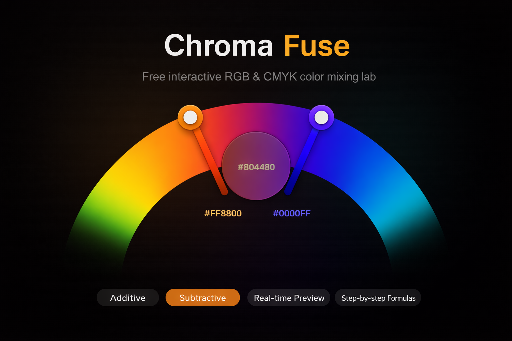
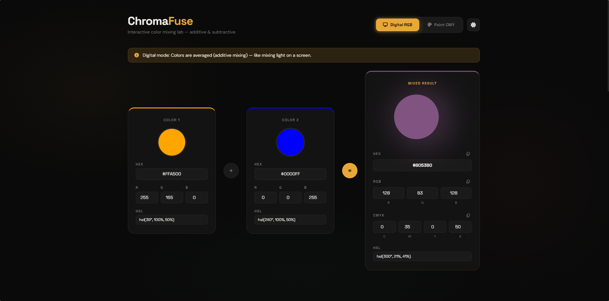
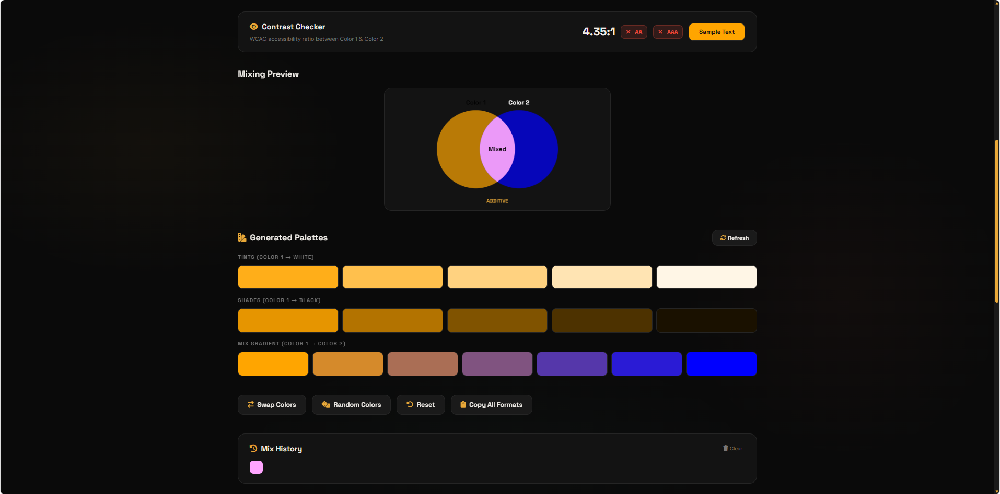
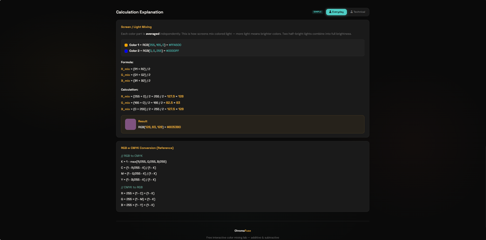
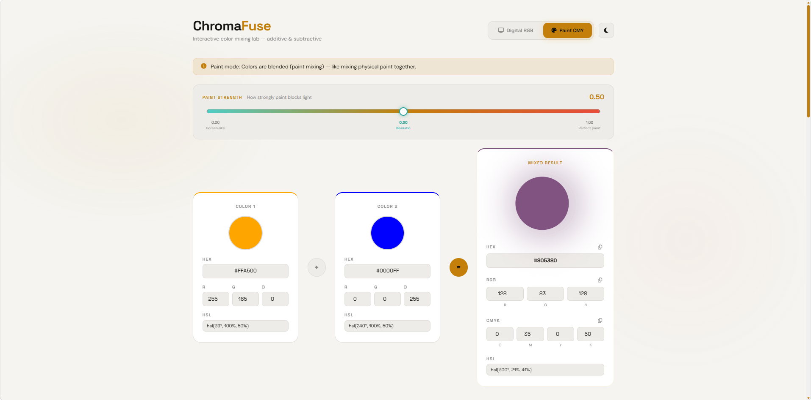
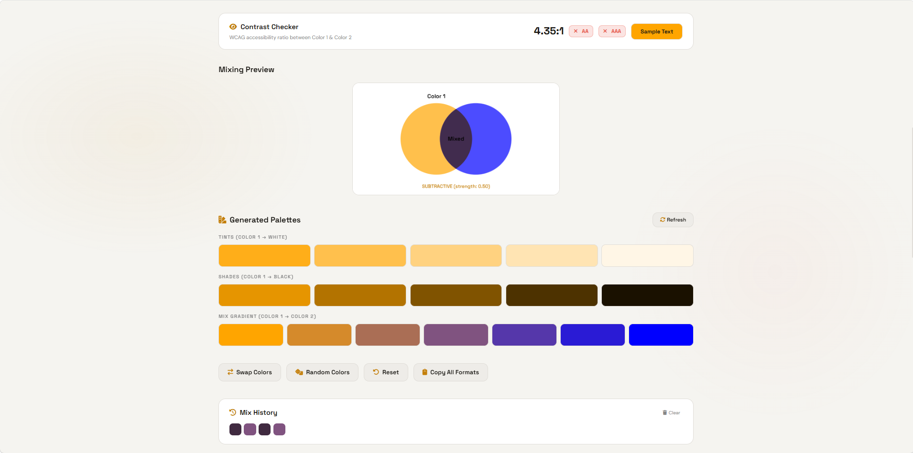
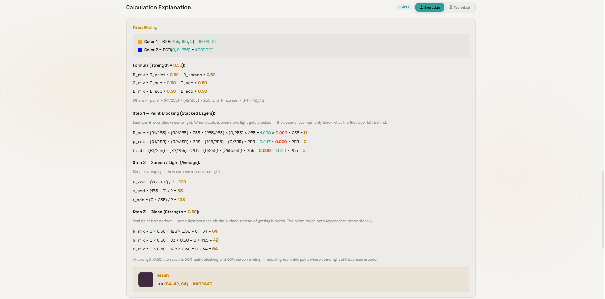

# 🌈 ChromaFuse — Interactive Color Mixing Lab

## 🌐 Live Demo

👉 https://chromafuse.netlify.app

A free, interactive color theory tool that accurately simulates both additive (RGB/screen) and subtractive (CMY/paint) color mixing with real-time formula breakdowns, accessibility analysis, and palette generation.



---

## 🧪 Why This Exists

Most online color mixers simply average RGB values, which is only correct for digital light and screens.

Real paint mixing behaves differently.

Physical pigments absorb portions of light, meaning reflectances multiply rather than average. ChromaFuse was built to visually demonstrate the difference between:

- 💡 Additive color mixing (screens/light)
- 🎨 Subtractive color mixing (paint/pigments)

The project combines real-world color theory, interactive UI engineering, accessibility tooling, and responsive frontend architecture into a single lightweight web application.

---

# ✨ Features

- 🎨 Dual Mixing Modes — Additive RGB and Subtractive Paint simulation
- 🧪 Multiplicative Reflectance Formula Simulation
- ⚡ Real-Time Formula Breakdown
- 🌗 Dark / Light Theme Support
- 📊 WCAG AA/AAA Accessibility Checker
- 🧠 Everyday ↔ Technical Terminology Toggle
- 🟣 Interactive Venn Diagram Visualization
- 🎯 Real-Time Palette Generation
- 🕘 Mix History Tracking
- 🔄 Bidirectional HEX / RGB / CMYK / HSL Editing
- 📱 Fully Responsive Design
- 🚀 Zero Dependencies — Pure HTML, CSS, and Vanilla JavaScript

---

# 🚀 Live Features

- Real-time RGB & CMYK mixing
- Hybrid subtractive paint simulation
- Interactive intensity slider
- Dynamic formula visualization
- Accessibility contrast analysis
- Palette and gradient generation
- Animated UI transitions
- Mobile-first responsive layout
- SEO optimized static deployment

---

# 📸 Preview

## 🌙 Dark Theme — Digital RGB Mode

### Main Mixing Interface



### Accessibility Checker, History & Venn Diagram



### Formula Breakdown & Technical Explanation



---

## ☀️ Light Theme — Paint Mixing Mode

### Paint Mixing Main Interface



### Accessibility Checker, History & Venn Diagram



### Formula Explanation & Mixing Breakdown



---

# 🎥 Demo Video

## Interactive Walkthrough

[Watch Demo Video](https://youtube.com/YOUR_VIDEO_LINK)

The demo showcases:

- Additive RGB mixing
- Subtractive paint simulation
- Formula visualization
- Accessibility checking
- Theme switching
- Palette generation
- Responsive UI behavior

---

# 🔬 The Math

## Additive Mixing (Digital / Screen)

```math
R_{mix} = \frac{R_1 + R_2}{2}
```

Digital displays emit light directly, so colors become brighter when combined.

---

## Subtractive Mixing (Paint / Pigments)

```math
R_{sub} = \left(\frac{R_1}{255}\right)\times\left(\frac{R_2}{255}\right)\times255
```

Pigments absorb portions of incoming light. Each additional pigment reduces remaining reflected light.

---

## Hybrid Paint Simulation

```math
R_{mix} = R_{sub}\times intensity + R_{add}\times(1-intensity)
```

The intensity parameter simulates:
- imperfect pigments
- surface scattering
- reflected light
- realistic paint behavior

---

# 🛠 Tech Stack

| Category | Technology |
|----------|-------------|
| Structure | Semantic HTML5 |
| Styling | Tailwind CSS, CSS Custom Properties |
| Logic | Vanilla JavaScript (ES6+) |
| Fonts | Space Grotesk, DM Sans |
| Icons | Font Awesome 6 |
| Deployment | Netlify |
| SEO | JSON-LD, Open Graph, Sitemap, Robots.txt |

---

# 📁 Project Structure

```txt
chromafuse/
├── index.html
├── README.md
├── LICENSE
├── robots.txt
├── sitemap.xml
├── og-preview.png
├── preview-1.png
├── preview-2.png
├── preview-3.png
├── preview-4.png
├── preview-5.png
├── preview-6.png
└── demo.mp4
```

> Why a single-file architecture?
>
> - Zero build pipeline
> - No framework overhead
> - Instant deployment
> - Faster loading
> - Easier maintainability
> - Maximum portability

---

# 🔧 Key Engineering Decisions

### Single-File Architecture

Built entirely inside a lightweight static structure without framework dependencies or build tooling.

### Multiplicative Reflectance Model

Implements physically inspired subtractive mixing instead of naive RGB averaging.

### Hybrid Paint Simulation

Combines additive and subtractive models using adjustable intensity blending.

### Accessibility-First Design

Integrated WCAG AA/AAA contrast calculations using sRGB relative luminance formulas.

### CSS Variable Theming

Dark/light themes powered through reusable CSS custom properties.

### Responsive UI System

Optimized for:
- mobile devices
- tablets
- desktop displays
- large screens

### Zero Dependency Philosophy

No React, no npm, no bundlers, and no runtime frameworks.

---

# ⚡ Performance

- 🚀 Lightweight static architecture
- ⚡ Instant page loading
- 📉 Minimal memory usage
- 📱 Mobile optimized
- 🎯 Lighthouse-friendly structure
- 🔍 SEO optimized metadata

---

# 🌍 SEO Optimization

- Open Graph tags
- Twitter preview metadata
- JSON-LD structured data
- robots.txt
- sitemap.xml
- Semantic HTML structure
- Responsive mobile-first layout

---

# 🎯 Use Cases

- Color theory education
- UI/UX experimentation
- Accessibility testing
- Digital art learning
- Paint mixing visualization
- Frontend engineering portfolio
- Interactive educational tooling

---

# 📄 License

PROPRIETARY SOURCE CODE - NON-COMMERCIAL USE ONLY

Copyright (c) 2026 jeyaprathap-LSA-01. All Rights Reserved.

This source code, associated files, and any derivatives thereof are the 
exclusive property of jeyaprathap-LSA-01.

RESTRICTIONS:
This repository is provided for **viewing, learning, and portfolio purposes only**.

Under no circumstances may this code be:
1. Copied, modified, compiled, or altered in any way without explicit 
   written permission from the author.
2. Distributed, sublicensed, sold, or used as part of any commercial 
   product, service, or internal business tool.
3. Used to build, train, or improve any commercial software, AI models, 
   or private business applications without a written commercial license.
4. Claimed as your own work or removed of the original copyright notice.

VIOLATION:
Any use of this code outside of personal, non-commercial viewing violates 
copyright law. Unauthorized use, distribution, or commercial exploitation 
of this code may result in legal action to the fullest extent permitted by 
applicable law.

TERMINATION:
This permission to view ends immediately upon any violation of these terms.

CONTACT:
For inquiries regarding commercial licensing or special permissions, please 
contact the author directly.
